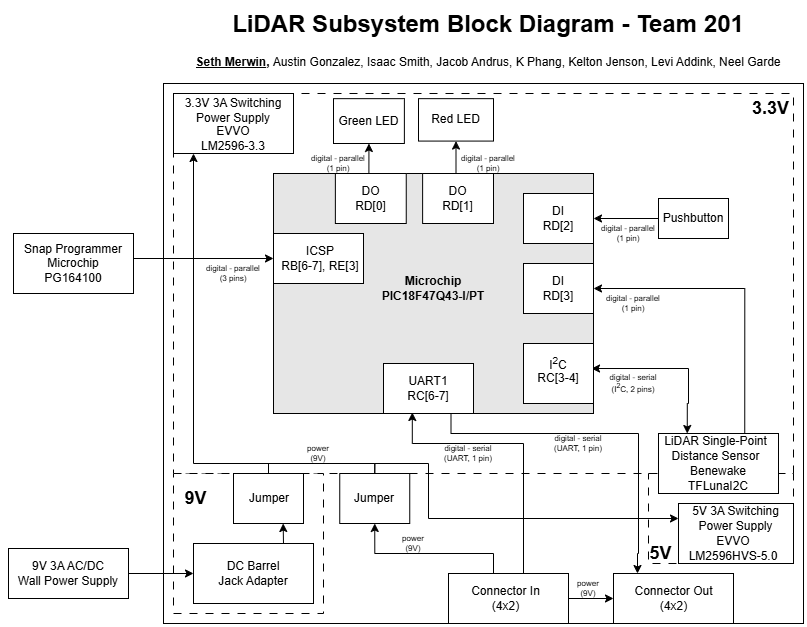

## Overview
This page provides a block diagram representing the hardware components in the Distance-Sensing subsystem, how they connect to each other, and how they are powered. The microcontroller and most components are powered by a regulated 3.3V switching DC. Jumpers have been put in place to allow switching the source power between one individual to the subsystem(for prototyping purposes) and one shared by the team(for the final design). All logic and control inside the subsystem will be handled by the Microchip PIC18F47Q43 surface-mount microcontroller. This subsystem wil make use of a single-point LiDAR ToF sensor to capture and process distance data, interacting with the microcontroller through I2C serial communication. The subsystem will use ICSP programming through the Microchip Snap debugger/programmer in order to update the software throughout the prototyping phase. Interaction with other subsystems will be through UART serial communication via one upstream ribbon connector and one downstream ribbon connector. Two generic LEDs and one generic pushbutton have also been added for subsystem status/debugging purposes.

## Block Diagram 

## Relation to Product Requirements

1. **Surface mounted, 3.3V switching power regulator:** Fulfilled by EVVO LM2596-3.3V Switching Voltage Regulator
2. **Surface mounted microcontroller:** Fulfilled by Microchip PIC18F47Q43-I/PT microcontroller
3. **Serial sensor:** Fulfilled by Benewake TF-Luna I2C LiDAR Single-Point Distance Sensor
4. **Able to determine distance from device to object in its path:** Fulfilled by TF-Luna sensor's range of up to 8 meters
5. **Wired communication:** Fulfilled by UART through upstream and downstream ribbon cable connectors
6. **Sufficient refresh rate:** Fulfilled by TF-Luna sensor's frame rate of up to 100Hz

## Resources

A PDF version of the block diagram is available [here](314IndividualBlockDiagram4.drawio.pdf), and the original drawio file [here](314IndividualBlockDiagram%20(3).drawio).
