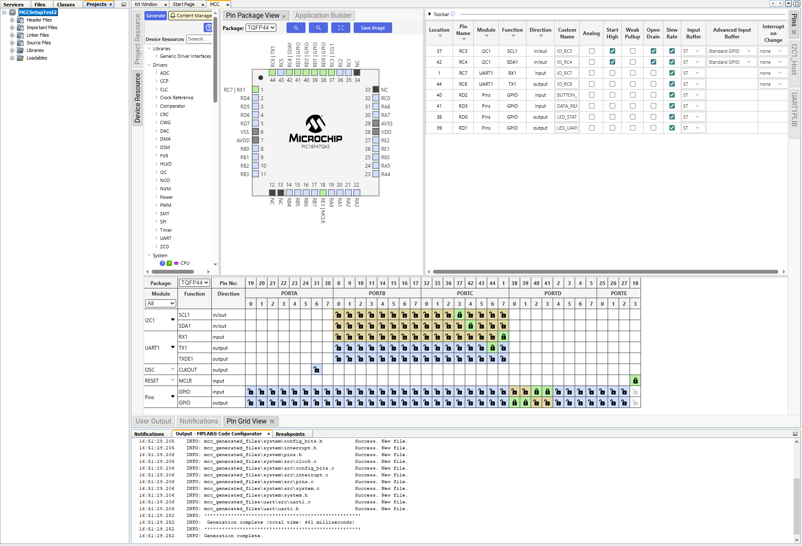

## Overview
This page contains resources for and details about the selected microcontroller for the distance-sensing module.

## Specifications/Links
| PIC Info                                      | Answer |
| --------------------------------------------- | ------ |
| Model                                         | **PIC18F47Q43** |
| Product Page URL                              | [Microchip](https://www.microchip.com/en-us/product/PIC18F47Q43) |
| Datasheet URL(s)                              | [Datasheet](https://ww1.microchip.com/downloads/aemDocuments/documents/MCU08/ProductDocuments/DataSheets/PIC18F27-47-57Q43-Microcontroller-Data-Sheet-XLP-DS40002147.pdf) |
| Application Notes URL(s)                      | [Getting Started with Writing C-Code for PIC18F](https://www.microchip.com/en-us/application-notes/tb3261) \* [Interfacing Serial EEPROMs with 8-Bit PIC Microcontrollers](https://ww1.microchip.com/downloads/aemDocuments/documents/OTH/ApplicationNotes/AppnoteSourceCode/EXP8I2CClick.X.zip) |
| Vendor link                                   | [Microchip Direct](https://www.microchipdirect.com/product/PIC18F47Q43-I/PT) |
| Code Examples                                 | N/A |
| External Resources URL(s)                     | [Scanning LiDAR device implemented on PIC](https://www.youtube.com/watch?v=mwJAvcA9KmY) |
| Unit cost                                     | $1.92/each |
| Supply Voltage Range                          | 1.8V/3.3V/5.5V/-0.3V ; +6.5V (Min/Nominal/Max/Absolute Max) |
| Absolute Maximum Current   (for entire IC) | 350 mA |
| Maximum GPIO current   (per pin)           | +/-50 mA |
| Supports External Interrupts?                 | Yes |
| Required Programming Hardware, Cost, URL      | [MPLAB SNAP](https://www.microchip.com/en-us/development-tool/pg164100); $10.99/each (already owned) |
| Works with MPLabX?                            | Yes |
| Works with Microchip Code Configurator?       | Yes |

## Pin Allocation
| Module | # Available | Needed | Associated Pins |
| ---------- | ----------- | ------ | ------------------------------ |
| GPIO       | 36          | 4      | RA(0-7), RB(0-7), RC(0-7), RD(0-7), RE(0-3) |
| ADC        | 35          | 0      | RA(0-7), RB(0-7), RC(0-7), RD(0-7), RE(0-2) |
| UART       | 5           | 1      | RA(4-5), RA(6-7), RB(4-5), RB(6-7), RC(6-7) |
| SPI        | 2           | 0      | {RA4, RB(2-3)}, {RA5, RC(3-4)} |
| I2C        | 1           | 1      | RC(3-4) |
| PWM        | 4           | 0      | RB5, RB7, RC(1-6) |
| ICSP       | 1           | 1      | RB(6-7) |

## Team Role
My role on the team is to create a module which can measure the distance from the product to an object in its path, process the data, and send it to the Human-Machine Interface. I will be using a single-point ToF LiDAR serial sensor to measure the distances. The sensor will be controlled by the PIC18F47Q43 microcontroller through I2C serial communication. My module will be sharing an external power source (battery) with the rest of the modules on the greater mobile unit. I will use a regulator to convert this power into a 3.3V switching power supply. My module will also be receiving data from the module directly upstream and passing it, along with the distance data, to the module directly downstream. This communication will be handled with UART serial communication. My module will not have its own display but will make use of a generic LED to signify module status.

## MPLABXIDE MCC Setup

The image below shows the setup of the Master Code Configurator inside MPLABXIDE, verifying that the chosen microcontroller can be used to power all necessary peripherals for the module.

The setup includes 2 pins for communicating with other modules through UART, 3 pins for controlling the LiDAR sensor through I2C, 2 GO pins for controlling the status-LEDs, and 1 GI pin for receiving a pushbutton signal(debugging). There are more than enough pins for all the functionality needed, and the MCC files have succesfully generated with no errors. This test generation is evidence that the microcontroller will be sufficient for this module's purposes.

## Final Microcontroller Choice: **PIC18F47Q43**

.png)

After researching, collecting resources, reviewing the datasheet, reviewing pin/module-allocation, and creating a test project in MPLABXIDE, it is safe to say that the PIC18F47Q43 will provide more than enough functionality for the purposes of the distance-sensing module. Not only do I have experience using the through-hole package of this microcontroller, I have also found a plethora of resources to feel comfortable using it for the project. It is low-cost, can be programmed using the SNAP tool which has already been provided, and has more than enough pins and modules. Finally, testing the setup in the MPLAB software has proven that it can be programmed for the use-case that is required.
