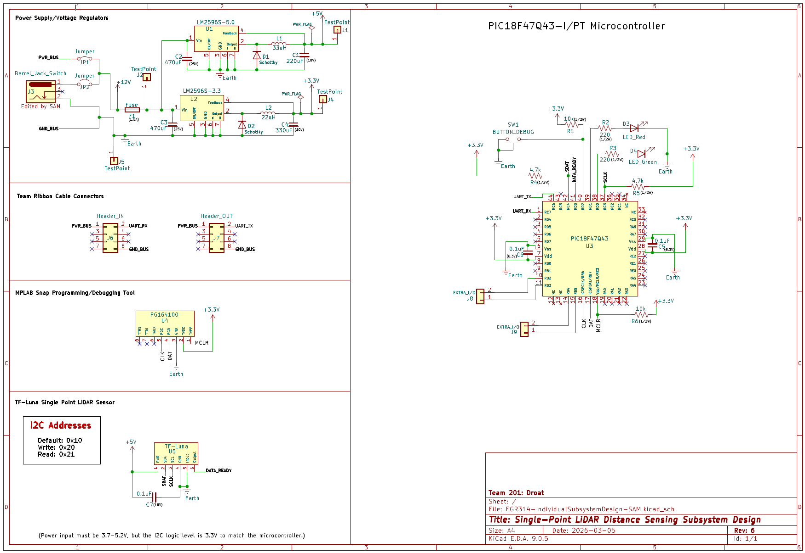
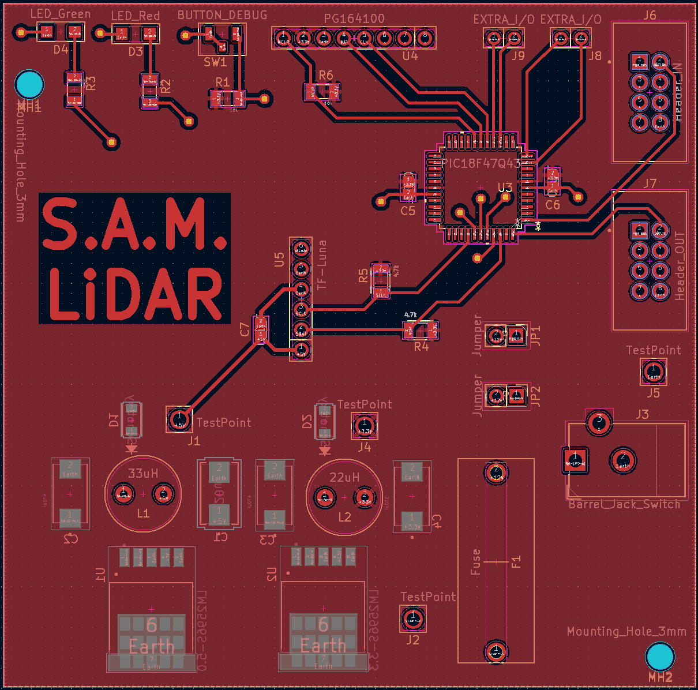
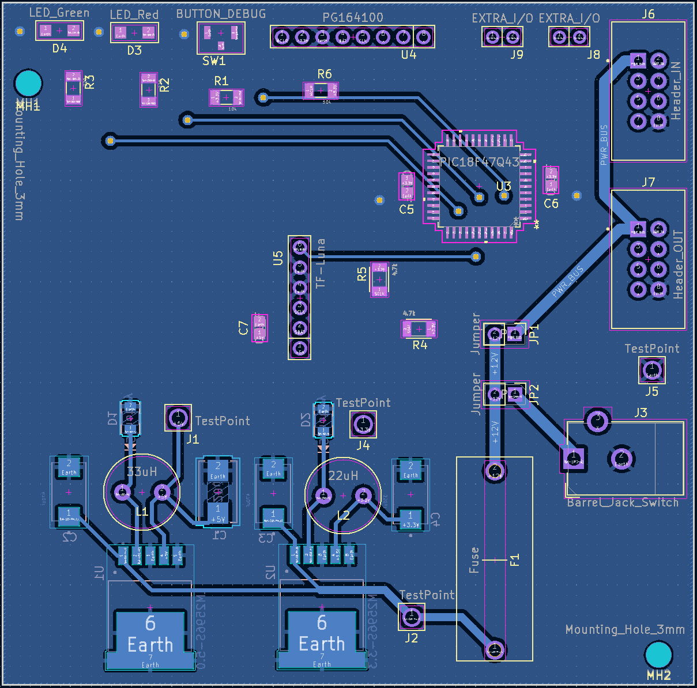
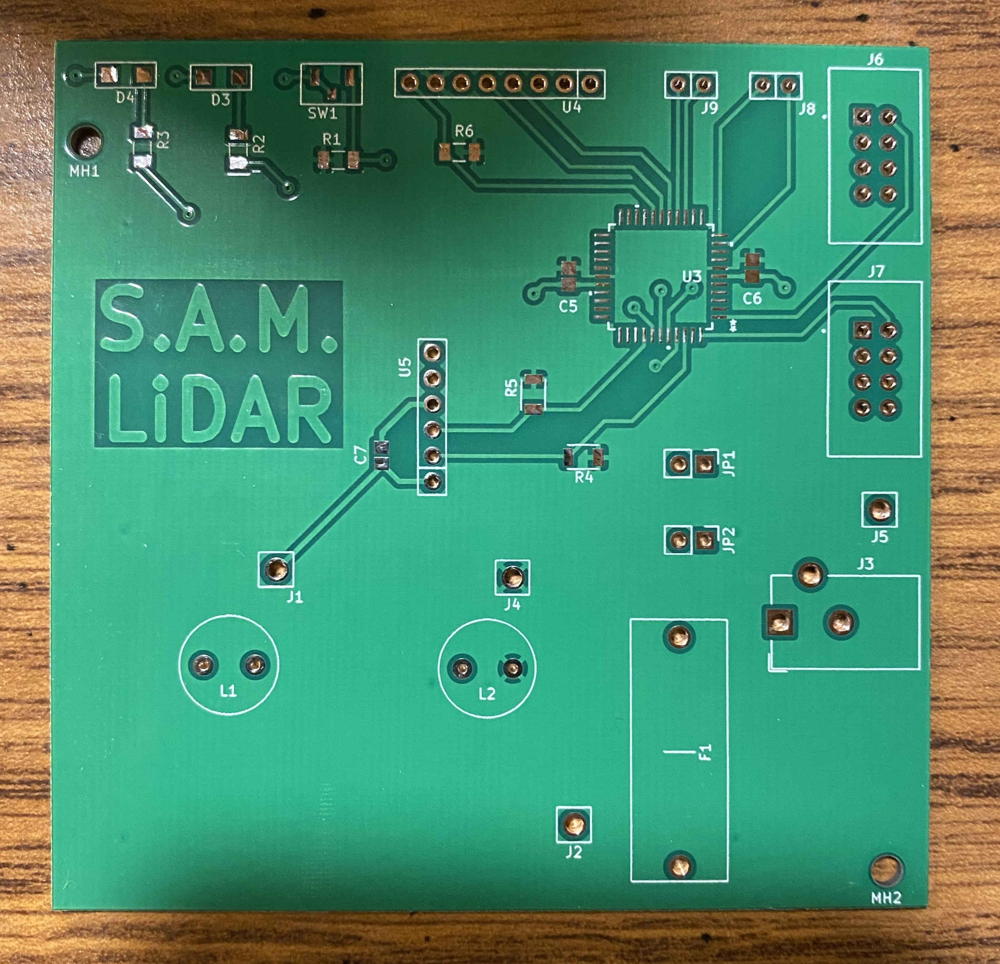
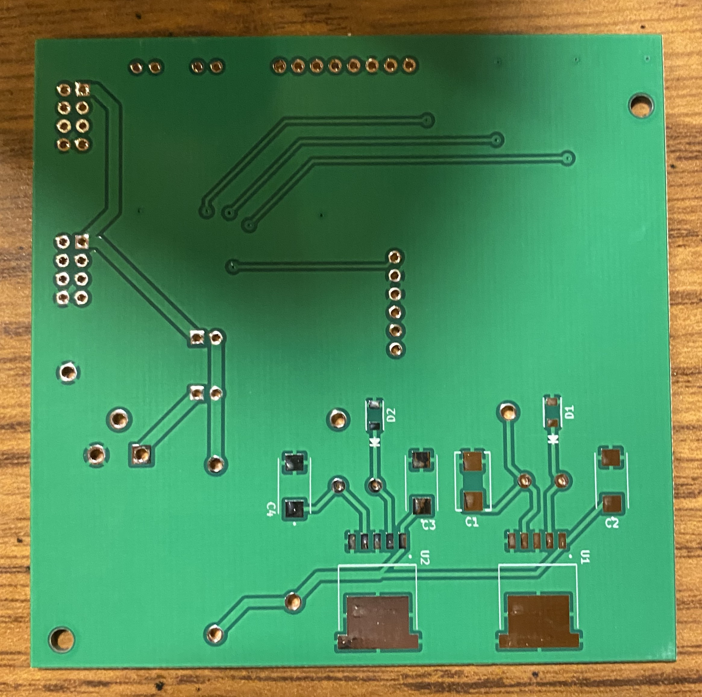
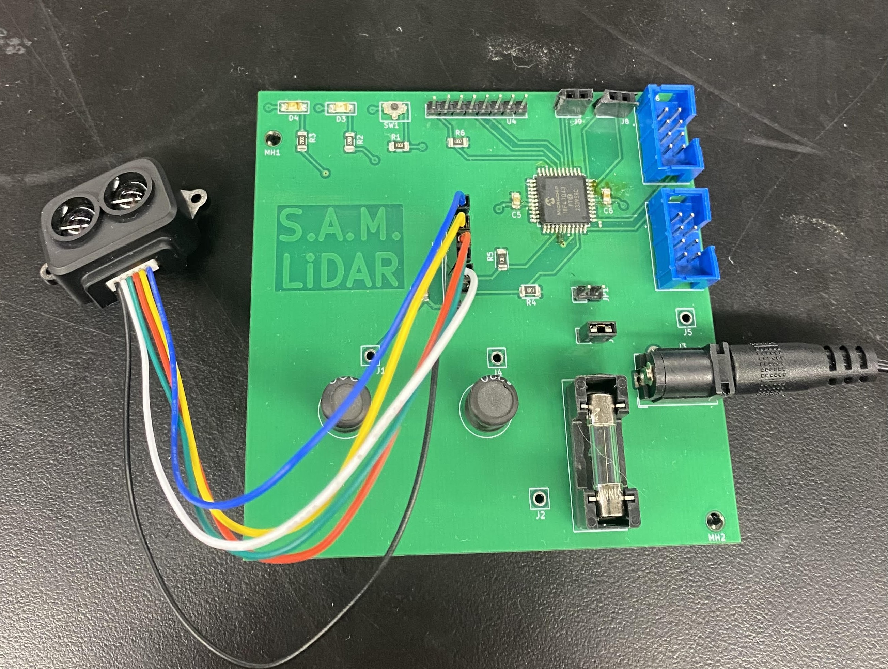
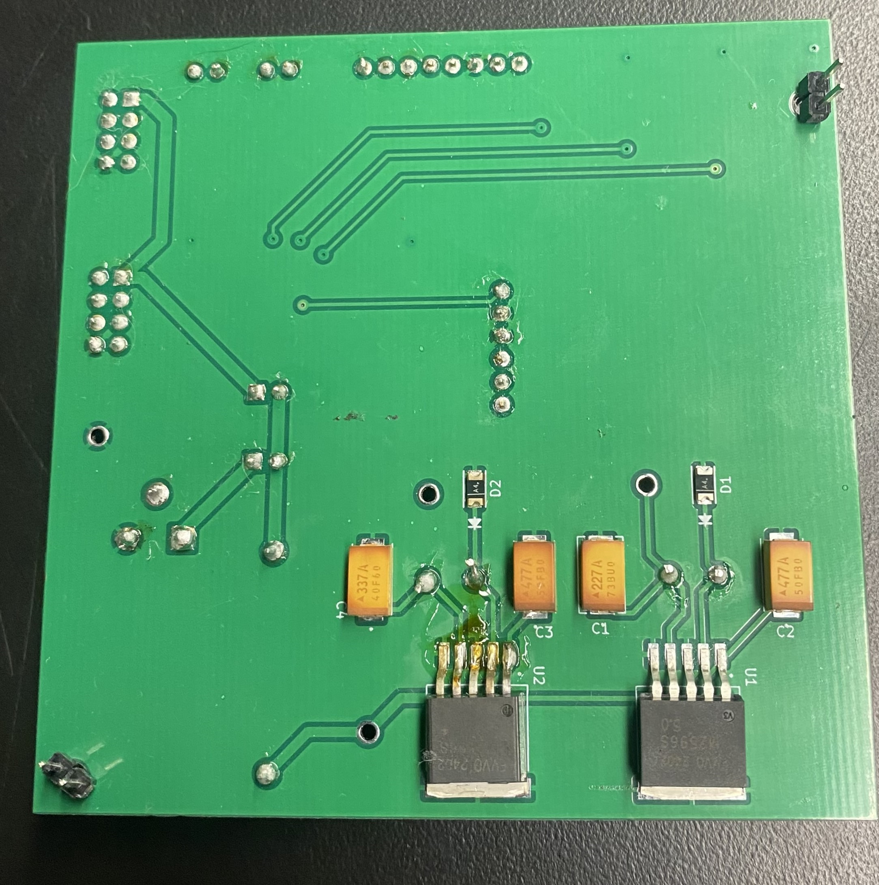

## Overview

This page shows the electrical schematic, circuit board design, and final physical printed circuit board for the subsystem.

## Schematic

This schematic below is designed to indicate the electrical connections/circuitry of the LiDAR subsystem. The "Power Supply/Voltage Regulators" section shows that power can be taken from the team bus connection or a wall supply via barrel jack, and it is sent through two different switching voltage regulators: one to provide 5V and one to provide 3.3V. This satisfies **Subsystem Requirement 1**. The "Team Ribbon Cable Connectors" section highlights the connections to team subsystems in and out for UART communication and shared power. This satisfies **Subsystem Requirement 5**. The "MPLAB Snap Programming/Debugging Tool" section shows the tool which will be used to upload code to the microcontroller after soldering it to the PCB. The "TF-Luna Single Point LiDAR Sensor" section shows the chosen LiDAR sensor and its connections to the microcontroller, as well as the data addresses which will be used for I2C communication. This satisfies **Subsystem Requirements 3, 4, and 6**. Finally, the "PIC18F47Q43-I/PT Microcontroller" section displays the chosen microcontroller for the subsystem, which of its pins connect to power/peripherals, two external status LEDs, one pushbutton for debugging purposes, and multiple extra headers connected to unused pins in the event that additions must be made to the system. This satisfies **Subsystem Requirement 2**. The subsystem as a whole will allow the user to effectively navigate the product's environment and collect data on its surroundings.

{style width:"350" height:"300;"}

## PCB(Printed Circuit Board)

### ECAD Design

The images below show the design of the PCB based on the electrical schematic above. The design was sent out to be manufactured into a physical board.

**Top Side**

{style width:"350" height:"300;"}

**Bottom Side**

{style width:"350" height:"300;"}

### Unpopulated Physical Board

These images show the physical circuit board before being populated with components.

**Top Side**

{style width:"350" height:"300;"}

**Bottom Side**

{style width:"350" height:"300;"}

### Populated Physical Board

These images show the physical board with all of the components soldered onto it.

**Top Side**

{style width:"350" height:"300;"}

**Bottom Side**

{style width:"350" height:"300;"}

## Resouces

The schematic as a PDF download is available [*here*](EGR314-IndividualSubsystemDesign-SAM.pdf), and the PCB design as a PDF download is available [*here*](314-IndividualSubsystemDesignPCB.pdf).

The Zip folder of the ECAD project is availabe [*here*](EGR314-IndividualSubsystemDesign-SAM.zip), and the PCB Gerber files [*here*](SethMerwin201.zip).

