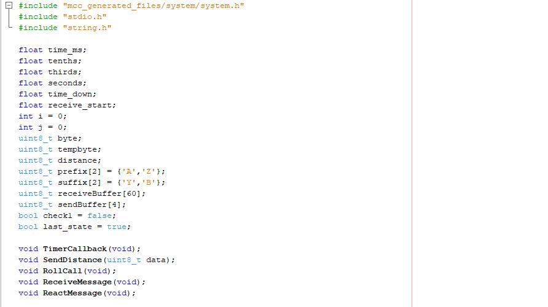
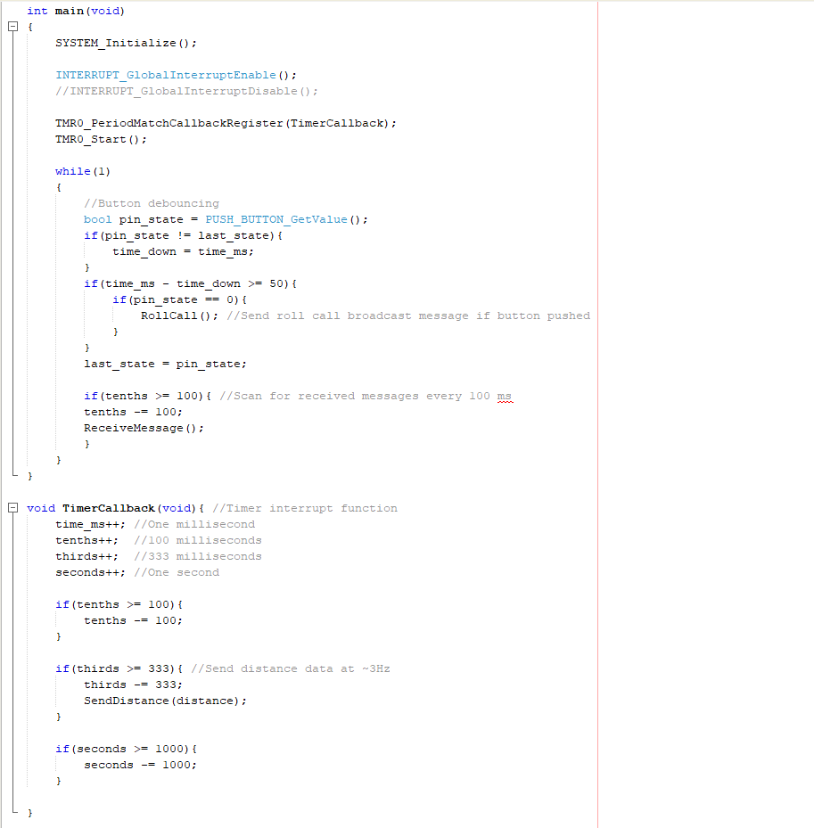
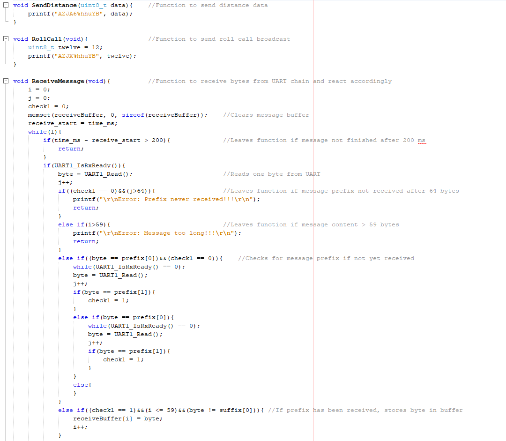
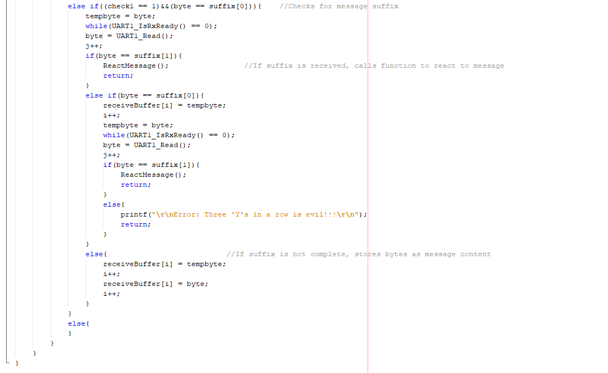
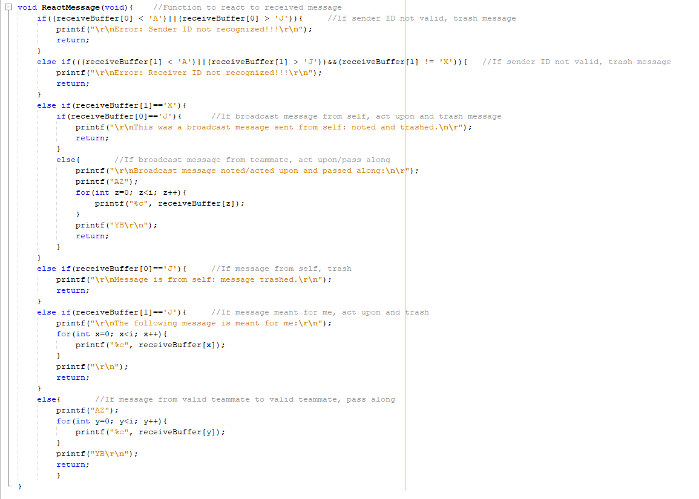

## Overview

The purpose of this page is to list and define all serial message types that will be received and/or sent out by my individual subsystem as part of the UART daisy chain. This ensures that I know what type of messages to expect and how to act on them. It also helps me identify incorrectly formatted/addressed messages and remove them from the communication chain.

## Message Types

### Send Acceleration Data

|                  |**Byte 1**         |**Byte 2**         |**Byte 3**         |**Byte 4**         |
|------------------|-------------------|-------------------|-------------------|-------------------|
|**Variable Name** | sender_id         | receiver_id       | message_type      | message_data      |
|**Variable Type** | char              | char              | char              | uint8_t           |
|**Min Value**     | H                 | A                 | E                 | 0                 |
|**Max Value**     | H                 | A                 | E                 | 255               |
|**Example**       | H                 | A                 | E                 | 125               |

This message sends the current speed of the craft from the Gyroscope/Accelerometer subsystem to the Controller subsystem to be updated and displayed on the User Interface. (Received by my subsystem and passed downstream)

### Send Distance Data

|                  |**Byte 1**         |**Byte 2**         |**Byte 3**         |**Byte 4**         |**Byte 5**         |**Byte 6**       |
|------------------|-------------------|-------------------|-------------------|-------------------|-------------------|-----------------|
|**Variable Name** | sender_id         | receiver_id       | message_type      | message_data      | message_data      | message_data    |
|**Variable Type** | char              | char              | char              | char              | char              | char            |
|**Min Value**     | J                 | A                 | F                 | '0'               | '0'               | '0'             |
|**Max Value**     | J                 | A                 | F                 | '9'               | '9'               | '9'             |
|**Example**       | J                 | A                 | F                 | '1'               | '8'               | '5'             |

This message sends the current distance measurement from the LiDAR subsystem to the Controller subsystem to be updated and displayed on the User Interface. (Sent out from my subsystem)

### Rollcall

|                  |**Byte 1**         |**Byte 2**         |**Byte 3**         |
|------------------|-------------------|-------------------|-------------------|
|**Variable Name** | sender_id         | receiver_id       | message_type      |
|**Variable Type** | char              | char              | char              |
|**Min Value**     | A                 | A                 | J                 |
|**Max Value**     | J                 | J                 | J                 |
|**Example**       | A                 | J                 | J                 |

This is a debugging broadcast message triggered by pushing the 'debug' button on any subsystems configured to do so. Not all systems are expected to be able to trigger rollcall, but all systems must respond to it. Lights up LEDs for a set interval on every subsystem that recieves it. (Received by my subsystem, acted upon, and either passed on or trashed)

## Communication Code

The code below shows the base-level software written to send messages out, and receive/translate/react to messages coming in.

