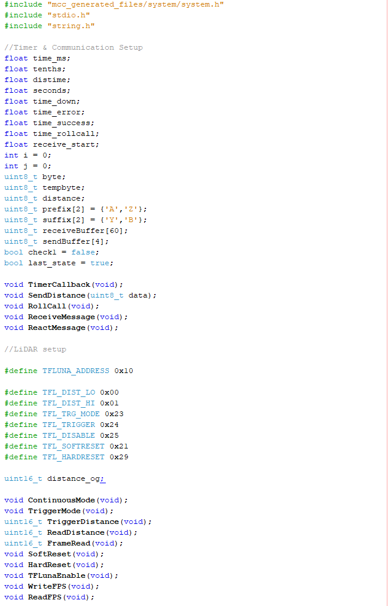
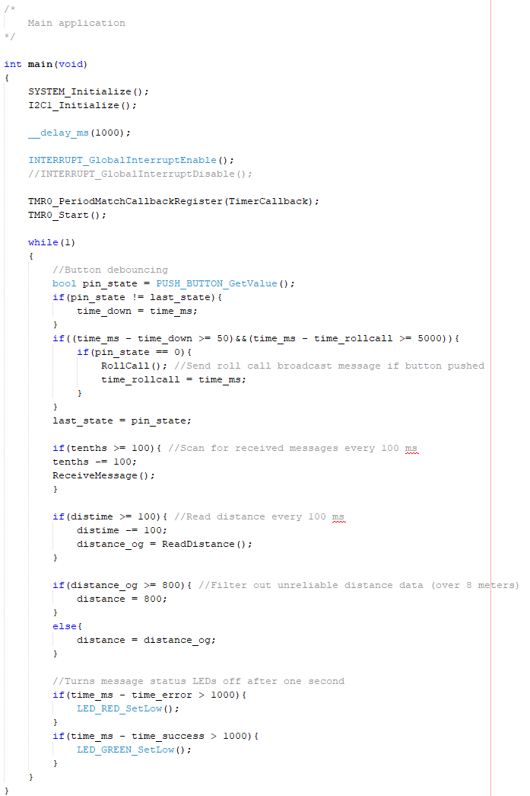
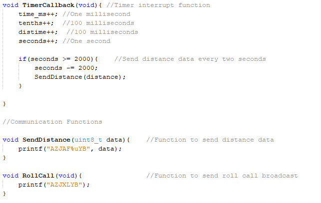
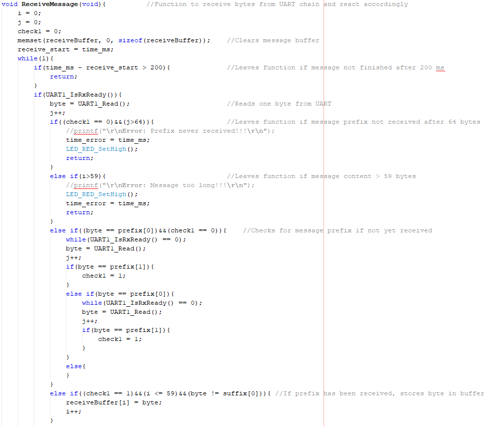
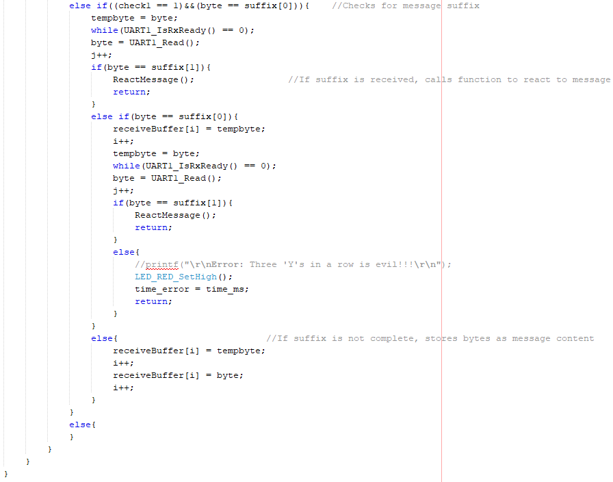
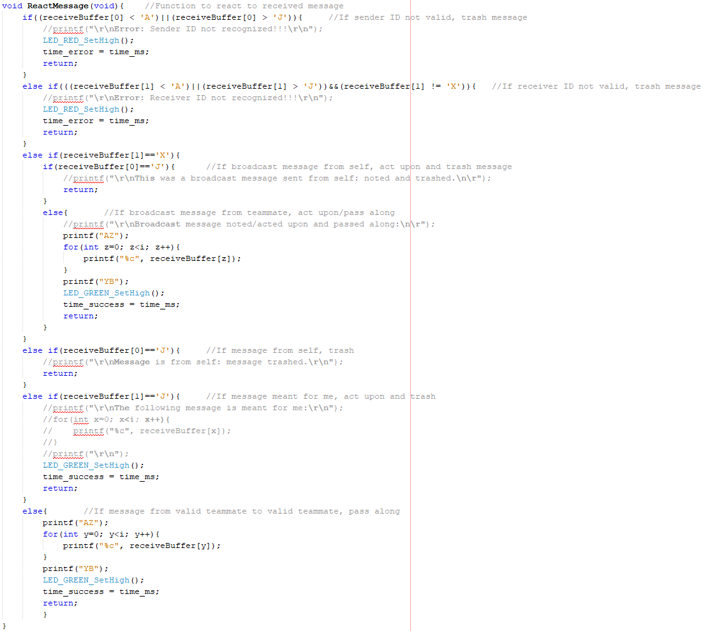
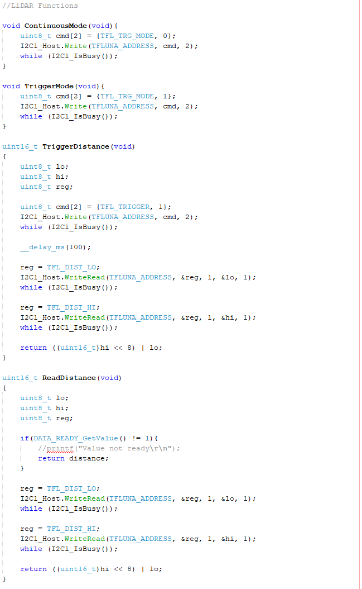
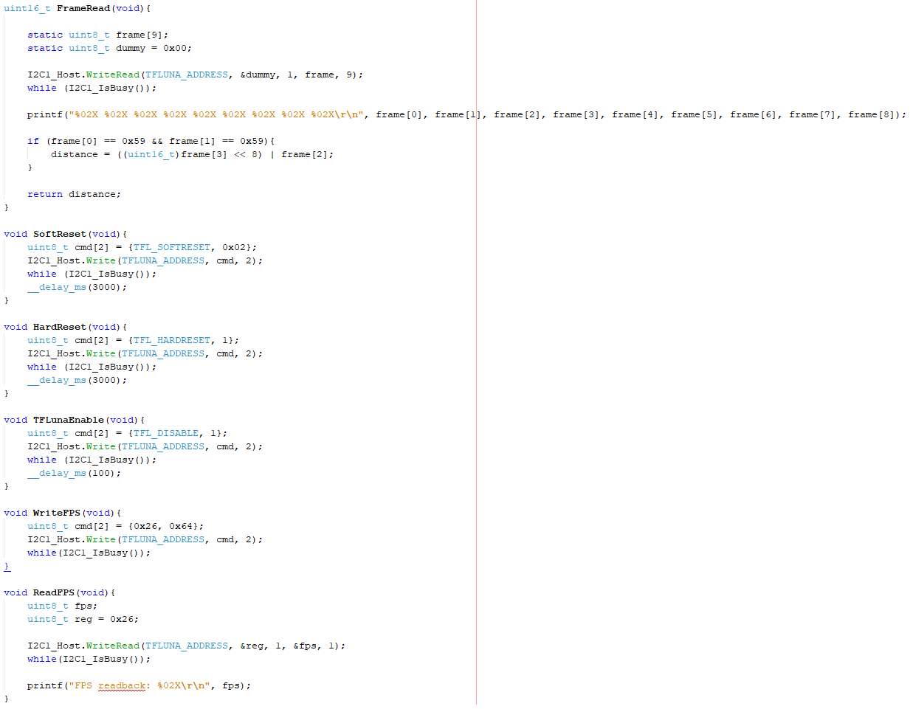

## Download Code

A zip file of the MPLAB X IDE code for the subsystem is available [here](EGR314LiDARFinal.zip).

## Video of Working Subsystem

<iframe width="665" height="1183" src="https://www.youtube.com/embed/GTPr5eSCkCs" title="LiDAR Distance-Sensing Subsystem for Project E-Fish-&amp;-Sea" frameborder="0" allow="accelerometer; autoplay; clipboard-write; encrypted-media; gyroscope; picture-in-picture; web-share" referrerpolicy="strict-origin-when-cross-origin" allowfullscreen></iframe>

## Screenshots of Final Code

Below is a series of screenshots showing the entire main.c file of the subsystem project.

